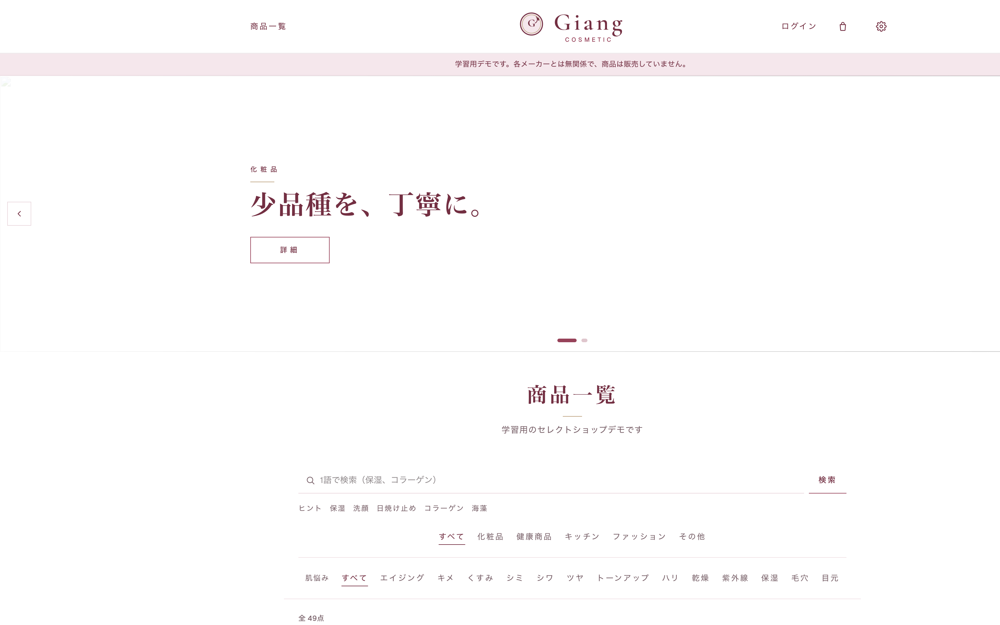
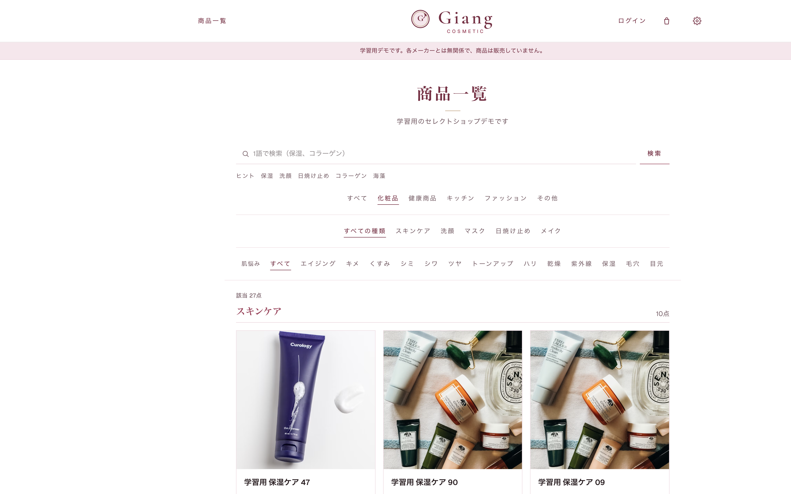
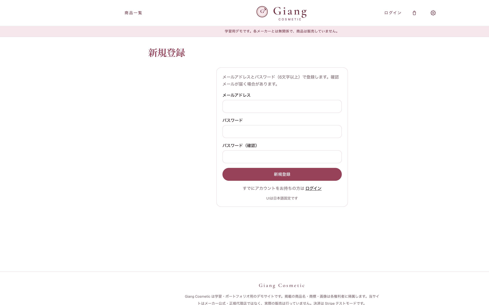
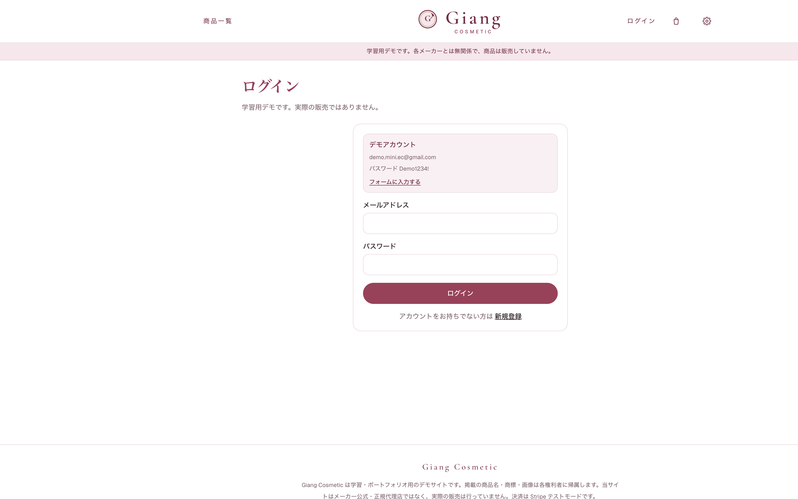

# Giang Cosmetic

学習・ポートフォリオ用のセレクトショップデモです。各メーカーとは無関係で、商品は販売していません。掲載の商品名・商標・画像は各権利者に帰属します。

少品種の化粧品・雑貨 UI を閲覧し、カートから Stripe（テストモード）まで通せる小さな EC アプリです。

## 面談用（この表を開く）

Mentor にはこの README か URL を見せる。localhost は使わない。

| 項目 | 値 |
| --- | --- |
| アプリ | Giang Cosmetic（学習用デモ。販売しない） |
| URL | https://mini-ec-phi.vercel.app |
| 新規登録 | https://mini-ec-phi.vercel.app/signup |
| Email | `demo.mini.ec@gmail.com` |
| Password | `Demo1234!` |
| Stripe | `4242 4242 4242 4242` / 未来月 / CVC 任意 |
| GitHub | `portfolio-submission` |
| 仕様 | `docs/01-企画.md` 〜 `docs/04-仕様-ワイヤーフレーム.md` |

**1文:** 企画は `docs/`、実装は Cursor、公開は Vercel。

**見てもらう順:** 一覧 → カート → 未ログインで `/checkout` → デモログイン → Stripe テスト → `/orders`。お気に入り / 管理画面は MVP 外。

## Demo

| 項目 | 値 |
| --- | --- |
| URL | https://mini-ec-phi.vercel.app |
| Email | `demo.mini.ec@gmail.com` |
| Password | `Demo1234!` |
| Stripe | テストカード `4242 4242 4242 4242` / 有効期限は未来月 / CVC 任意 |

本番のカードは使わないでください。お金は動きません。検索エンジンには `noindex` しています。

## レビュー用（6 ステップ）

1. 商品一覧で検索 / カテゴリ / 肌悩みフィルタ → カードをクリック
2. 在庫ありの商品をカートに入れる（ヘッダー件数が増える）
3. `/cart` で数量変更 → リロードしても残る
4. 未ログインで `/checkout` を開く → `/login?next=...`
5. 上のデモアカウントでログイン → 配送先 → Stripe `4242…` → 完了
6. `/orders` に支払い済みが出る。390px でもヘッダーが崩れない

MVP 外: 管理画面、お気に入り、レビュー投稿。企画は `docs/01-企画.md`。

## できること

- 商品一覧（名前・成分検索、カテゴリ / 肌悩み）
- 商品詳細（在庫・掲載サンプル・カート追加）
- カート（localStorage、ログイン不要）
- 新規登録 / ログイン（Supabase Auth）
- 配送先入力 → Stripe Checkout（テスト）
- 注文履歴（ログイン必須）
- サポートチャット（右下。Vercel AI Gateway 経由の LLM）

未ログインで `/checkout` または `/orders` を開くと `/login?next=...` に戻します。

## 実装の予定

いま動く範囲（MVP）は上の「できること」。これから足す候補:

- お気に入り（Figma 任意。ログイン後に保存）
- 商品レビュー投稿
- 管理画面（在庫・商品の追加。今は Supabase で投入）
- 注文キャンセルの画面操作（いまは Stripe 側のキャンセルで在庫を戻す）

## 画面

| 画面 | キャプチャ |
| --- | --- |
| トップ / 一覧 |  |
| 化粧品カタログ |  |
| 新規登録 |  |
| ログイン |  |

動作の短い GIF は未掲載。Mentor には URL で実機を見てもらう。

## 技術

- Next.js 16 App Router / React 19 / TypeScript / Tailwind CSS 4
- Supabase（Postgres + Auth）
- Stripe Checkout（Test mode）
- Vercel AI Gateway（右下チャット）

## 前提条件

- Node.js 20 以上
- npm 10 以上（Node 付属で可）
- Git
- アカウント: Supabase / Stripe（テスト） / Vercel

## ローカル起動

```bash
npm install
npm run dev
```

必要な環境変数（`.env.local`）:

| 変数 | 用途 |
| --- | --- |
| `NEXT_PUBLIC_SUPABASE_URL` | Supabase プロジェクト URL |
| `NEXT_PUBLIC_SUPABASE_PUBLISHABLE_KEY` | ブラウザ用キー（anon） |
| `SUPABASE_SERVICE_ROLE_KEY` | サーバーのみ。注文・在庫 |
| `STRIPE_SECRET_KEY` | Checkout（テストキー） |
| `STRIPE_WEBHOOK_SECRET` | 決済完了 webhook |
| `NEXT_PUBLIC_BASE_URL` | アプリの公開 URL |
| `AI_GATEWAY_API_KEY` | 右下チャット用（任意） |
| `AI_GATEWAY_MODEL` | 例: `google/gemini-3.5-flash-lite` |

```
NEXT_PUBLIC_SUPABASE_URL=
NEXT_PUBLIC_SUPABASE_PUBLISHABLE_KEY=
SUPABASE_SERVICE_ROLE_KEY=
STRIPE_SECRET_KEY=
STRIPE_WEBHOOK_SECRET=
NEXT_PUBLIC_BASE_URL=http://localhost:3000
AI_GATEWAY_API_KEY=
AI_GATEWAY_MODEL=google/gemini-3.5-flash-lite
```

Supabase Auth の Redirect URLs に次を追加する:

- `http://localhost:3000/auth/callback`
- `https://mini-ec-phi.vercel.app/auth/callback`

メール確認がオンの場合、登録後に届くリンクがここへ戻ります。デモ用なら Confirm email をオフにするか、Dashboard で確認済みユーザーを1件作る。

## 仕様

画面とデータは `docs/` を参照（`01-企画.md`、`02-仕様-データモデル.md`、`03-仕様-画面.md`、`04-仕様-ワイヤーフレーム.md`）。Figma の「お気に入り」は任意機能のため未実装です。カリキュラムの仕様シートは Google スプレッドシートのコピーに記入し、Demo URL と合わせて提出する。

## レビュー観点セルフチェック

仕様は `docs/03-仕様-画面.md`、レイアウトは `docs/04-仕様-ワイヤーフレーム.md`、Figma「お気に入り / レビュー投稿」は対象外。

| 観点 | 確認 |
| --- | --- |
| 仕様との差分 | 一覧・詳細・カート・認証・決済・注文履歴が揃う。肌悩みフィルタと出所表示あり。お気に入りは未実装 |
| 新規登録 | `/signup` で確認パスワード不一致を弾く。確認メール後は `/auth/callback`。レビューはデモアカウントで可 |
| 認可 | 未ログインの `/checkout` `/orders` `/account` は `/login?next=...`。`/api/checkout` は 401 |
| 在庫 | 売り切れは追加不可。追加後は `stock` でクランプ。カート行はリロード後も残る |
| 空・エラー | 商品0件、カート空、404、一覧の再読み込み、注文0件に CTA |
| レスポンシブ | 390px でロゴとカートが同一行。ログイン時は「注文」がヘッダーに出る |
| セキュリティ | service role はサーバーのみ。`safeNextPath` でオープンリダイレクト防止。`robots.txt` は noindex |
| 決済 | Stripe テストカードのみ。webhook で `paid`。キャンセル時は在庫を戻す |
| LLM | 右下チャットが `/api/chat` から AI Gateway を呼ぶ。固定文の fake bot ではない |
